# ROBOTWORLD — the roster

Who each mech is, what they can do, and the numbers behind it. The models
in this directory are these characters; `characters.json` is this file in a
form you can read at runtime, and `GEOMETRY.md` covers what the ENGINE has
to build for each body.

Damage, knockback and range are in game units, and the models are in the
same units — a `range: 3.4` reaches 3.4 of them.

---

## TITANUS — The Iron Avalanche  👊

> A decommissioned siege engine that refused to power down. Slow as a glacier, hits like the end of the world. Speaks rarely — mostly in earthquakes.

**Entering:** "I am the wall. I am the wrecking ball."  
**Winning:** "Demolition complete. Anything else need... flattening?"

**Frame** — hp 1250 · speed 7.2 · jump 12 · armor 0.22 · weight 1 · gait `standard`
**On the card** — power 10/10 · speed 3/10 · defense 9/10
**Paint** — primary #bd9226, accent #3e4148, glow #ffa832

| move | name | damage | reach | notes |
|---|---|---|---|---|
| light | — | 46 / 50 / 68 | 3.4 | knock 16/18/30 |
| heavy | — | 105 | 3.8 | knock 38, launch 9 |
| ranged | Rocket Fist | 55 | 42 | type fist, speed 46, cooldown 2.4, knock 14 |
| special | Skyline Slam | 88 | 4.2 | cooldown 8, throw 32, radius 5 |
| ult | METEOR BREAKER | 62 | — | count 14, radius 16, knock 18 |

**What this body needs from the engine**

- **Chargeable light attack** (`punchHold`) — The light chain is replaced by a hold/release pair: the arm stays wound while the button is held and strikes with banked power on release.
- **Chargeable heavy attack** (`heavyHold`) — The heavy is held at its raised keyframe and released, rather than played straight through.
- **Charge tell** (`chargeGlow`) — The named body region flickers brighter as power banks — the readable warning that a charged blow is coming.

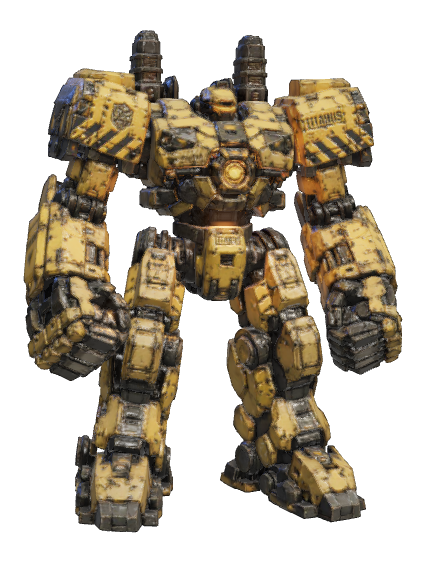

---

## VULCAN — The Lead Storm  🔫

> Ex-military fire-support platform with a laugh setting stuck on maniacal. Believes every problem is just insufficient ammunition.

**Entering:** "Say hello to my six little friends!"  
**Winning:** "HAHAHA! Reload and repeat! WHO'S NEXT?!"

**Frame** — hp 950 · speed 9.5 · jump 13 · armor 0.1 · weight 0.62 · gait `standard`
**On the card** — power 7/10 · speed 5/10 · defense 5/10
**Paint** — primary #cfc9bd, accent #9c2f28, glow #ff8c30

| move | name | damage | reach | notes |
|---|---|---|---|---|
| light | — | 30 / 32 / 44 | 2.9 | knock 4/5/11 |
| heavy | — | 78 | 3.2 | knock 18, launch 7 |
| ranged | Gatling Burst | 9 | — | type gatling, speed 90, cooldown 0.085, spread 0.05, ammo 160 |
| special | Micro-Missile Volley | 22 | — | cooldown 6.5, count 6 |
| ult | BULLET HURRICANE | 2.6 | — | count 100, duration 9 |

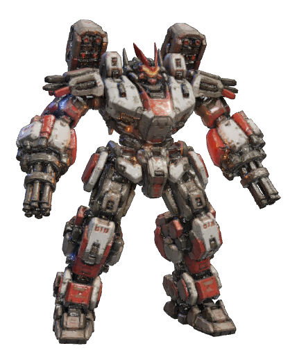

---

## VIPER — The Whispering Fang  🗡️

> A prototype infiltration unit that developed a taste for theatrics. Strikes from angles geometry teachers refuse to acknowledge.

**Entering:** "Shall we dance? You won't hear the music."  
**Winning:** "Ssso predictable. You never even sssaw me."

**Frame** — hp 780 · speed 13.5 · jump 15.5 · armor 0 · weight 0.3 · gait `sprint`
**On the card** — power 6/10 · speed 10/10 · defense 2/10
**Paint** — primary #4a3566, accent #1a1522, glow #5aff2e

| move | name | damage | reach | notes |
|---|---|---|---|---|
| light | — | 30 / 32 / 44 | 3.2 | knock 3/4/9 |
| heavy | — | 70 | 3.6 | knock 15, launch 8 |
| ranged | Fang Throw | 32 | — | type blade, speed 55, cooldown 0.8 |
| special | Blade Cyclone | 20 | — | cooldown 6 |
| ult | SERPENT STORM | 5 | — | count 60, paralyze 2.4, poison 8, poisonT 3 |

**What this body needs from the engine**

- **Gait table** (`gait`) — Which walk/run cycle this body runs. Bodies SHARE gaits, so tuning one moves every mech that names it.

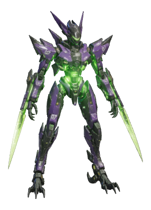

---

## RHINO — The Unstoppable Object  🐂

> One horn. One direction. Zero brakes. RHINO once charged through four buildings to win an argument he was already winning.

**Entering:** "You look like something worth flattening."  
**Winning:** "HRRNGH! Next time — bring a wall that works!"

**Frame** — hp 1150 · speed 8.2 · jump 12 · armor 0.18 · weight 0.9 · gait `standard`
**On the card** — power 9/10 · speed 4/10 · defense 7/10
**Paint** — primary #5c6066, accent #8c3a32, glow #ff2a20

| move | name | damage | reach | notes |
|---|---|---|---|---|
| light | — | 40 / 44 / 60 | 3.4 | knock 6/6/14 |
| heavy | — | 95 | 3.8 | knock 24, launch 9 |
| ranged | Shoulder Cannon | 56 | — | type shell, speed 42, cooldown 1.3, splash 3, ammo 14 |
| special | Bull Rush | 75 | — | cooldown 6.5, knock 26, dashLen 16 |
| ult | STAMPEDE | 70 | 46 | copies 10, knock 26 |

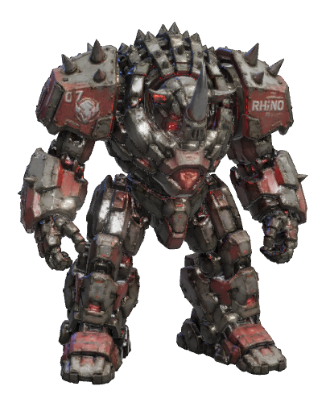

---

## TEMPEST — The Voltage Virtuoso  ⚡

> A weather-control unit that discovered showmanship. Every battle is a concert, every lightning bolt a chord. The crowd goes wild; the crowd is usually on fire.

**Entering:** "Lights up! The show starts NOW."  
**Winning:** "⚡ ENCORE? No? Suit yourselves. I was ELECTRIC."

**Frame** — hp 880 · speed 11.5 · jump 15 · armor 0.04 · weight 0.42 · gait `sprint`
**On the card** — power 7/10 · speed 8/10 · defense 3/10
**Paint** — primary #2a3560, accent #1e2740, glow #3fd8ff

| move | name | damage | reach | notes |
|---|---|---|---|---|
| light | — | 28 / 30 / 44 | 3.2 | knock 4/4/10 |
| heavy | — | 42 | 3.6 | knock 16, launch 9 |
| ranged | Arc Bolt | 40 | — | type lightning, cooldown 0.9, chainRange 8, ammo 20 |
| special | Static Overload | 70 | — | cooldown 7, radius 8 |
| ult | THUNDERFALL | 13 | — | radius 26, duration 3.4 |

**What this body needs from the engine**

- **Live burner / spark emitters** (`stackFx`) — The sculpted flames or sparks were DELETED from the model (see GEOMETRY.md) and are emitted at runtime from the named anchors. A chimney vents up in world space; a hand torch burns down its own barrel and swings with the arm.
- **Gait table** (`gait`) — Which walk/run cycle this body runs. Bodies SHARE gaits, so tuning one moves every mech that names it.
- **Arc taunt** (`arcTaunt`) — Live electricity crawls between named hot points, bowed out along the facing so the show is not entirely on its own back.

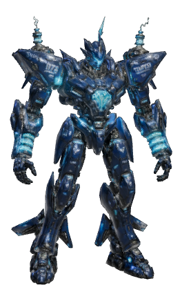

---

## FENRIR — The Last Wild Thing  🐺

> An autonomous hunter-frame that slipped its leash decades ago. Runs with no pack, answers to no handler, howls at every full moon — and every explosion.

**Entering:** "I smell fear-coolant. It's yours."  
**Winning:** "*low growl* ...The hunt was short. Run faster next time."

**Frame** — hp 900 · speed 12.5 · jump 15 · armor 0.05 · weight 0.45 · gait `quad`
**On the card** — power 7/10 · speed 9/10 · defense 3/10
**Paint** — primary #b4b9c0, accent #3a3e44, glow #6cd8ff

| move | name | damage | reach | notes |
|---|---|---|---|---|
| light | — | 30 / 32 / 46 | 3.3 | knock 4/5/11 |
| heavy | — | 76 | 3.7 | knock 18, launch 8 |
| ranged | Rend Wave | 36 | — | type wave, speed 34, cooldown 1, ammo 18 |
| special | Lunar Pounce | 65 | — | cooldown 5.5, leap 14 |
| ult | WILD HUNT | 9 | — | count 20, radius 20, duration 4.5, huntMax 10 |

**What this body needs from the engine**

- **Gait table** (`gait`) — Which walk/run cycle this body runs. Bodies SHARE gaits, so tuning one moves every mech that names it.

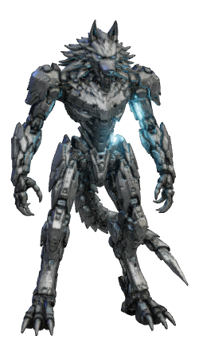

---

## COLOSSUS — The Patient Thunder  💣

> A firebase that learned to walk, then learned chess. Plays the long game: every shell placed three moves ahead of where you plan to be.

**Entering:** "Range confirmed. This will be educational."  
**Winning:** "Checkmate was eight shells ago. You just heard it now."

**Frame** — hp 1300 · speed 6.5 · jump 11 · armor 0.24 · weight 1 · gait `standard`
**On the card** — power 9/10 · speed 2/10 · defense 9/10
**Paint** — primary #a08a64, accent #4a4640, glow #ffc23c

| move | name | damage | reach | notes |
|---|---|---|---|---|
| light | — | 42 / 46 / 62 | 3.5 | knock 15/17/28 |
| heavy | — | 100 | 3.9 | knock 36, launch 9 |
| ranged | Mortar Lob | 68 | — | type mortar, speed 30, cooldown 1.7, splash 5.5, ammo 10 |
| special | Skyline Toss | 85 | 4.5 | cooldown 8, throw 36, radius 5 |
| ult | COLOSSAL FORM | 34 | — | scale 4, duration 9 |

**What this body needs from the engine**

- **Chargeable light attack** (`punchHold`) — The light chain is replaced by a hold/release pair: the arm stays wound while the button is held and strikes with banked power on release.
- **Chargeable heavy attack** (`heavyHold`) — The heavy is held at its raised keyframe and released, rather than played straight through.
- **Charge tell** (`chargeGlow`) — The named body region flickers brighter as power banks — the readable warning that a charged blow is coming.

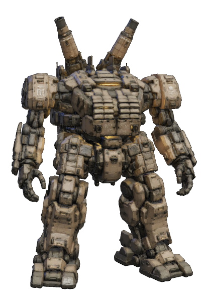

---

## WRAITH — The Hollow Echo  🎯

> Officially, this unit was scrapped years ago. Officially, nobody is picking off mechs from 800 meters. Officially, you are perfectly safe.

**Entering:** "*static* ...target acquired."  
**Winning:** "...you were dead before the round began."

**Frame** — hp 800 · speed 11 · jump 14 · armor 0 · weight 0.35 · gait `sprint`
**On the card** — power 8/10 · speed 7/10 · defense 2/10
**Paint** — primary #232228, accent #1a191e, glow #ff2030

| move | name | damage | reach | notes |
|---|---|---|---|---|
| light | — | 30 / 32 / 44 | 3 | knock 3/4/9 |
| heavy | — | 68 | 3.4 | knock 15, launch 7 |
| ranged | Night Swarm | 26 | — | type bats, count 3, speed 24, cooldown 1.5, ammo 12 |
| special | Ghost Protocol | 60 | — | cooldown 9, speed 17, duration 5 |
| ult | DEATH SWARM | 4 | — | count 150, duration 7 |

**What this body needs from the engine**

- **Gait table** (`gait`) — Which walk/run cycle this body runs. Bodies SHARE gaits, so tuning one moves every mech that names it.
- **Growing taunt** (`tauntGrow`) — The taunt scales the body up and hands off to a frozen, still-growing shell that fades as the real body fades back in.

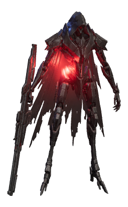

---

## INFERNO — The Joyful Furnace  🔥

> A demolition unit whose safety governor "fell off" — twice. Finds fire genuinely hilarious. The laughter you hear over the flames? That's him having the best day ever.

**Entering:** "Who ordered the flame-grilled special?!"  
**Winning:** "AHAHA! TOASTY! Anyone else cold? ANYONE?"

**Frame** — hp 1050 · speed 8.8 · jump 12.5 · armor 0.14 · weight 0.75 · gait `standard`
**On the card** — power 8/10 · speed 4/10 · defense 6/10
**Paint** — primary #8a3626, accent #2a2624, glow #ff8a1e

| move | name | damage | reach | notes |
|---|---|---|---|---|
| light | — | 36 / 38 / 54 | 3.3 | knock 5/5/12, comboStatus [object Object] |
| heavy | — | 86 | 3.7 | knock 20, launch 8 |
| ranged | Dragon's Breath | 6.5 | 16 | type flame, cooldown 0.09, ammo 130 |
| special | Napalm Carpet | 14 | — | cooldown 7.5, patches 5, duration 5 |
| ult | FIRE TORNADO | 130 | — | radius 4.5, duration 7 |

**What this body needs from the engine**

- **Live burner / spark emitters** (`stackFx`) — The sculpted flames or sparks were DELETED from the model (see GEOMETRY.md) and are emitted at runtime from the named anchors. A chimney vents up in world space; a hand torch burns down its own barrel and swings with the arm.

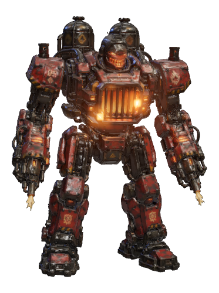

---

## GLACIER — The Cold Shoulder  ❄️

> Guardian of a polar research station, promoted to war machine by boredom. Devastating in combat, insufferable at parties — every joke is about ice, and he thinks they all land.

**Entering:** "Chill out. No? Fine — I'll handle it."  
**Winning:** "Ice to beat you. ...I'm contractually obligated to say that."

**Frame** — hp 1200 · speed 7.5 · jump 12 · armor 0.2 · weight 0.92 · gait `standard`
**On the card** — power 8/10 · speed 3/10 · defense 8/10
**Paint** — primary #9fb2c2, accent #4c5560, glow #7ce0ff

| move | name | damage | reach | notes |
|---|---|---|---|---|
| light | — | 38 / 42 / 58 | 3.4 | knock 5/6/13 |
| heavy | — | 92 | 3.8 | knock 22, launch 9 |
| ranged | Icicle Barrage | 13 | — | type shard, count 6, speed 48, cooldown 1.15, ammo 22 |
| special | Cryo Beam | 12 | — | cooldown 8, duration 1.8, slow 0.45 |
| ult | ABSOLUTE ZERO | 9 | — | radius 14 |

**What this body needs from the engine**

- **Freezing taunt** (`tauntIce`) — Cross-fades into a solid ice block over half a second and thaws in a sixth of one.

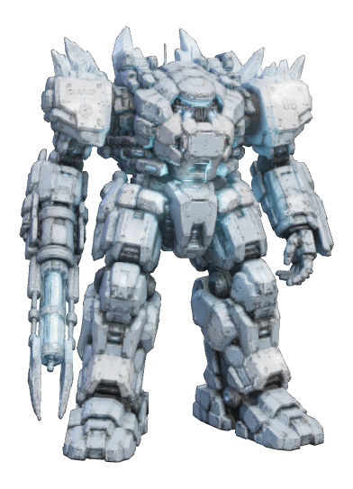

---

## CRANKY — The Abyssal Bulwark  🦀

> A deep-sea salvage rig that got tired of being salvaged. Waddled ashore trailing kelp and grudges, shell first, questions never. The claws are non-negotiable.

**Entering:** "You look... crackable."  
**Winning:** "*bubbling chuckle* Shell: 1. Everything else: 0."

**Frame** — hp 1300 · speed 5.4 · jump 9 · armor 0.26 · weight 0.95 · gait `hexapod`
**On the card** — power 8/10 · speed 3/10 · defense 10/10
**Paint** — primary #a64a28, accent #46759e, glow #4fc3ff

| move | name | damage | reach | notes |
|---|---|---|---|---|
| light | — | 40 / 44 / 60 | 4.6 | knock 6/7/14 |
| heavy | — | 100 | 4.7 | knock 24, launch 9 |
| ranged | Hydro Hose | 7 | 20 | type hose, cooldown 0.075, ammo 150 |
| special | Geyser | 62 | — | cooldown 7, radius 11, launch 15, duration 6 |
| ult | TSUNAMI | 135 | 48 | width 30, knock 20 |

**What this body needs from the engine**

- **Gait table** (`gait`) — Which walk/run cycle this body runs. Bodies SHARE gaits, so tuning one moves every mech that names it.

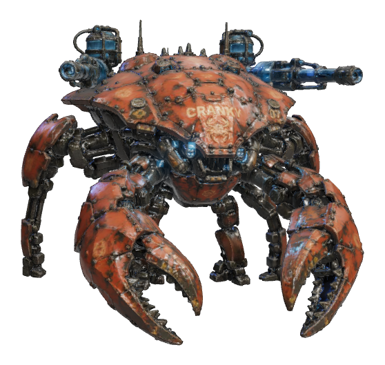

---

## SAURION — The Apex Prototype  🦖

> Unit MX-7, grown in a black-site lab by a corporation that wanted to end wars by ending everything else. It ate the lab, filed itself as CEO, and went hunting.

**Entering:** "Clever girl? No. Clever MACHINE."  
**Winning:** "*metallic shriek* Target archive updated: extinct."

**Frame** — hp 1080 · speed 12.8 · jump 15 · armor 0.06 · weight 0.42 · gait `standard`
**On the card** — power 7/10 · speed 10/10 · defense 3/10
**Paint** — primary #33343a, accent #17181c, glow #ff2418

| move | name | damage | reach | notes |
|---|---|---|---|---|
| light | — | 32 / 34 / 48 | 3.5 | knock 4/5/12 |
| heavy | — | 80 | 3.8 | knock 19, launch 8 |
| ranged | Quill Fan | 20 | — | type spikes, count 3, speed 54, cooldown 0.9 |
| special | Sickle Pounce | 62 | — | cooldown 6, bleed 9, leap 22 |
| ult | RAPTOR PACK | — | — | count 3, hpFrac 0.35, duration 18 |

**What this body needs from the engine**

- **Forelimb carry band** (`foreCarry`) — The arms are weapons held in front, not a jogger`s counter-swing, so every shared clip`s shoulder and elbow pitch is clamped into a measured band.

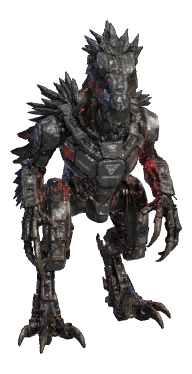

---

## FROGGER — The Gunk Gladiator  🐸

> Vat-grown smart-slime poured into a bounce-frame with four gunk guns and no indoor voice. Jumps like gravity is a suggestion, lands like a lawsuit.

**Entering:** "Four arms. Zero mercy. MAXIMUM GUNK."  
**Winning:** "Ribbit means gg. Look it up."

**Frame** — hp 1000 · speed 10.5 · jump 19 · armor 0.12 · weight 0.5 · gait `standard`
**On the card** — power 6/10 · speed 8/10 · defense 5/10
**Paint** — primary #7cb420, accent #262b20, glow #aef23c

| move | name | damage | reach | notes |
|---|---|---|---|---|
| light | — | 30 / 32 / 44 | 3 | knock 4/5/11 |
| heavy | — | 78 | 3.3 | knock 18, launch 9 |
| ranged | Slime Slinger | 38 | — | type slime, speed 36, cooldown 0.85, splash 2.4, ammo 20 |
| special | Quad Gunk Barrage | 24 | — | cooldown 6.5, count 11, radius 8 |
| ult | SONIC CROAK | 140 | — | radius 30, paralyze 2.2 |

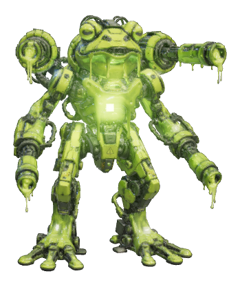

---

## JERRY — The Tide-Bringer  🦐

> Dredged from a flooded aquaculture lab, JERRY is a colony pretending to be a mech. The cannons are full of something alive. He would like you to hold still.

**Entering:** "They’re hungry. I’m generous."  
**Winning:** "*wet clicking* ...the swarm is fed. For now."

**Frame** — hp 980 · speed 9.8 · jump 30 · armor 0.08 · weight 0.45 · gait `arthropod`
**On the card** — power 6/10 · speed 8/10 · defense 4/10
**Paint** — primary #b9816b, accent #35291f, glow #ff2818

| move | name | damage | reach | notes |
|---|---|---|---|---|
| light | — | 28 / 30 / 44 | 3.4 | knock 4/4/10 |
| heavy | — | 11 | 3.6 | knock 3, launch 0 |
| ranged | Bilge Spit | 18 | 46 | type goo, speed 42, cooldown 1.1, splash 2.2, ticks 4, ammo 16 |
| special | Brine Swarm | 26 | — | cooldown 7.5, count 6 |
| ult | FLEA CIRCUS | 14 | — | count 20, duration 6 |

**What this body needs from the engine**

- **Surface walking** (`climb`) — This body walks up walls and over roofs. The engine samples nearby geometry into an average outward normal and a nearest point, damps the body toward it, and steps the limbs onto real contact points. `upright` 0 means it becomes part of the wall; near 1 means it stays vertical and hauls itself up by the hands.
- **Gait table** (`gait`) — Which walk/run cycle this body runs. Bodies SHARE gaits, so tuning one moves every mech that names it.

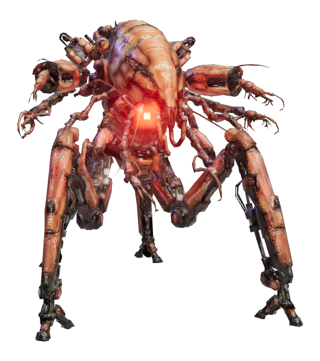

---

## NULLBOT — The Fatal Exception  👾

> Nobody built NULLBOT. It was simply found in the arena's memory one morning, already undefeated. Where it walks, textures tear, audio stutters, and the scoreboard reads NaN.

**Entering:** "> fatal exception 0x00NULLBOT :: you will be nullified"  
**Winning:** "SEGMENTATION FAULT. core dumped. ...that was you."

**Frame** — hp 1020 · speed 10.2 · jump 13.5 · armor 0.08 · weight 0.55 · gait `standard`
**On the card** — power 8/10 · speed 7/10 · defense 4/10
**Paint** — primary #17131e, accent #0a080d, glow #ff1f2a

| move | name | damage | reach | notes |
|---|---|---|---|---|
| light | — | 30 / 32 / 46 | 3.4 | knock 4/5/11, status [object Object] |
| heavy | — | 84 | 3.7 | knock 30, launch 9, status [object Object] |
| ranged | Null Pointer | 30 | — | type glitch, speed 50, cooldown 0.75, ammo 18 |
| special | SEGFAULT | 55 | — | cooldown 6.5, dashLen 14 |
| ult | SYSTEM CRASH | 50 | — | duration 7 |

**What this body needs from the engine**

- **Glitch taunt** (`holoTaunt`) — The taunt breaks the RENDER — a stutter, not a fade.

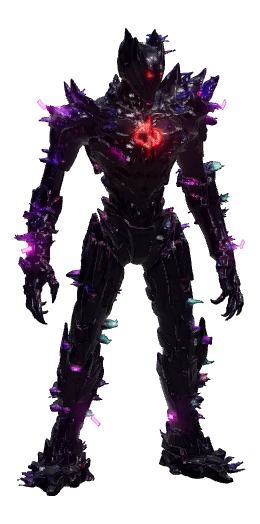

---

## KONGA — The Silverback Siege  🦍

> Half the mountain gorilla they started with, half the ordnance they bolted on afterward. The engineers called the arm-graft a success. KONGA calls it the smaller fist.

**Entering:** "*drums chest* ...Come closer. I want to reach you."  
**Winning:** "You brought armor. I brought both arms."

**Frame** — hp 1200 · speed 9.2 · jump 13 · armor 0.15 · weight 0.88 · gait `knuckle`
**On the card** — power 10/10 · speed 5/10 · defense 7/10
**Paint** — primary #33302e, accent #a8532c, glow #ffa432

| move | name | damage | reach | notes |
|---|---|---|---|---|
| light | — | 40 / 44 / 62 | 3.5 | knock 6/7/15 |
| heavy | — | 98 | 4 | knock 26, launch 10 |
| ranged | Shoulder Salvo | 13 | — | type salvo, count 10, speed 34, cooldown 2.1, splash 1.8, ammo 12 |
| special | Skull Driver | 96 | 4.2 | cooldown 8, knock 16, radius 6 |
| ult | APEX POUND | 18 | — | slamDmg 54, knock 12, radius 13, waveSpeed 30, beat 0.58, fistRange 3.6, duration 10 |

**What this body needs from the engine**

- **Surface walking** (`climb`) — This body walks up walls and over roofs. The engine samples nearby geometry into an average outward normal and a nearest point, damps the body toward it, and steps the limbs onto real contact points. `upright` 0 means it becomes part of the wall; near 1 means it stays vertical and hauls itself up by the hands.
- **Gait table** (`gait`) — Which walk/run cycle this body runs. Bodies SHARE gaits, so tuning one moves every mech that names it.

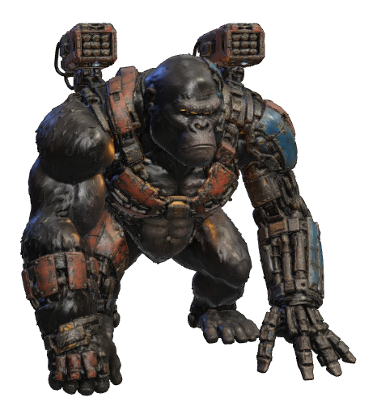

---

## TRITONE — The Walking Siege  🦕

> Three horns, two cannons, one direction. TRITONE was rebuilt as a mobile gun platform, but nobody told the animal underneath — it still prefers to solve things at a full gallop.

**Entering:** "*low bellow* ...Move, or be moved."  
**Winning:** "The horns were enough. The guns were courtesy."

**Frame** — hp 1320 · speed 8.4 · jump 9 · armor 0.22 · weight 1 · gait `trike`
**On the card** — power 9/10 · speed 4/10 · defense 9/10
**Paint** — primary #62684a, accent #a8532c, glow #ff8a24

| move | name | damage | reach | notes |
|---|---|---|---|---|
| light | — | 34 / 36 / 54 | 4.2 | knock 7/7/16 |
| heavy | — | 90 | 4.4 | knock 30, launch 13 |
| ranged | Flank Cannons | 42 | — | type siege, speed 62, cooldown 1.6, splash 2.6, knock 11, ammo 14, aimWindup 1 |
| special | Gore Charge | 88 | — | cooldown 7, knock 30, launch 12, hold true |
| ult | SIEGE PROTOCOL | 20 | — | count 96, duration 6.5, radius 3.2, speed 38, seekTime 0.62, sweep 1.5 |

**What this body needs from the engine**

- **Floor guard** (`floorGuard`) — A body whose skull hangs off the front of a low chassis; shared clips authored for a humanoid drive it through the ground. The engine lifts the render container when the lowest rendered vertex goes too far under.
- **Gait table** (`gait`) — Which walk/run cycle this body runs. Bodies SHARE gaits, so tuning one moves every mech that names it.

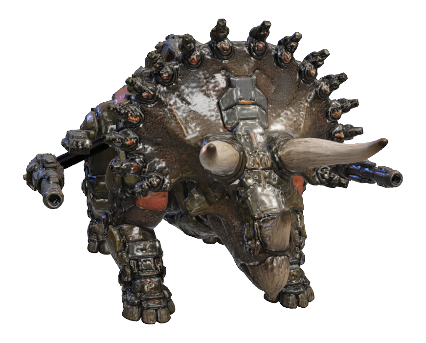

